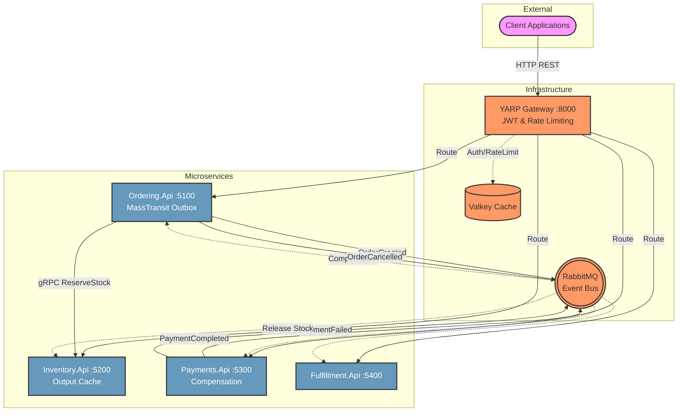

# 🛒 E-Commerce Microservices Platform

[](https://www.nuget.org/packages/BarisOzy.Microservices.CleanArchitecture.Template)
[](https://www.nuget.org/packages/BarisOzy.Microservices.CleanArchitecture.Template)
[](https://github.com/barisozy/microservices-clean-architecture/actions)
[](https://github.com/barisozy/microservices-clean-architecture/actions)
[](#)

> **.NET 10 LTS · Onion Architecture · MassTransit (v8, MIT) · Keycloak · YARP · Aspire · Valkey**

A production-grade, solo-buildable microservices template following a **true microservices pattern** — independent data ownership, independent deployability, and per-service CI/CD pipelines in a monorepo. Created and maintained by **barisozy**.

## ✨ Why Choose This Template? (Value Proposition)

Unlike basic CRUD examples, this template is designed for **production readiness** and **developer experience (DX)** right out of the box:

- 🛡️ **True Clean Architecture**: Strictly enforced dependency rules. The Domain layer has zero dependencies.
- 🧠 **CQRS with Read/Write Separation**: Commands write to PostgreSQL, Queries fetch directly from Valkey for O(1) read performance.
- 🎭 **Saga Pattern (Choreography)**: Distributed transactions across microservices with automated rollback and compensation.
- 📦 **Transactional Outbox Pattern**: Built-in with MassTransit and EF Core for guaranteed eventual consistency.
- 🤝 **Independent Event Contracts**: Integration events are centralized in a standalone `ECommerce.Contracts` package to strictly decouple producers and consumers.
- 🚀 **.NET Aspire Orchestration**: 1-click local development with distributed tracing, metrics, and logs via Aspire Dashboard.
- 🔐 **Secure by Default**: Keycloak integrated JWT validation and YARP Gateway rate limiting (via Valkey).
- 📡 **Hybrid Communication**: Synchronous inter-service gRPC calls alongside asynchronous RabbitMQ events.
- 📊 **OpenTelemetry Ready**: Pre-configured OTel instrumentation across all services.
- 🔄 **Independent CI/CD**: Path-filtered GitHub Actions for each microservice, demonstrating true independent deployability.

---

## 👤 Author & Maintainer

Developed by **barisozy** — [https://github.com/barisozy](https://github.com/barisozy)

[](https://github.com/sponsors/barisozy)

> **Enjoying this project?** If you find this microservices template helpful, consider [sponsoring on GitHub](https://github.com/sponsors/barisozy) to support ongoing maintenance and new features!

---

## 🚀 Quick Start (1-Click Install)

Get started immediately by installing the template and generating your microservices project:

```bash
# 1. Install the template from NuGet
dotnet new install BarisOzy.Microservices.CleanArchitecture.Template

# 2. Generate your new project
dotnet new ecom-clean-arch -n MyCompany.MyStore

# 3. Run the entire infrastructure & services via Aspire
cd MyCompany.MyStore
dotnet run --project src/Orchestration/MyCompany.MyStore.AppHost
```

---

## 🏗️ Architecture Overview



### Layer Structure (per service)

Each service follows **Onion Architecture** — dependency arrows point inward only. This is enforced structurally by the `.csproj` reference graph: the Domain project has **zero** `PackageReference` to EF Core/gRPC/ASP.NET Core, so a boundary violation fails to compile.

```
Service/
├── Service.Domain/          ← Entities, Domain Events, Enums. Zero external deps.
├── Service.Application/     ← CQRS (MediatR Commands/Queries), Consumers, Validators. No EF/infra.
├── Service.Infrastructure/  ← EF Core (Write Model), Valkey (Read Model), MassTransit. Implements Application interfaces.
└── Service.Api/             ← Minimal API endpoints, Program.cs, Dockerfile.
```

---

## Services

| Service | Port | Responsibilities |
|---------|------|------------------|
| **Gateway** | 8000 | YARP reverse proxy, JWT validation, rate limiting (Valkey-backed) |
| **Ordering.Api** | 5100 | Orders, Basket (Valkey Hash), MassTransit Outbox |
| **Inventory.Api** | 5200 | Stock management, gRPC server (ReserveStock / ReleaseStock), Output Cache |
| **Payments.Api** | 5300 | Mock payment processing, compensation saga |
| **Fulfillment.Api** | 5400 | Shipment, mock notification |

---

## Tech Stack

| Category | Technology | Version |
|----------|-----------|---------|
| Runtime | .NET / C# | 10.0 LTS |
| Framework | ASP.NET Core | 10.0 |
| ORM | Entity Framework Core | 10.0 |
| DB | PostgreSQL | 18.4 |
| Messaging | RabbitMQ + MassTransit (v8, MIT) | 4.3.1 / 8.5.4 |
| Cache/Lock | Valkey (BSD-3-Clause) | 9.1 |
| Gateway | YARP | 2.3.0 |
| Identity | Keycloak | 26.6.4 |
| gRPC | Grpc.AspNetCore / Grpc.Net.Client | 2.80.0 |
| Observability | OpenTelemetry + Serilog | 1.17.0 / 4.3.1 |
| Orchestration | .NET Aspire | 13.4.x |
| Testing | xUnit v3 + Shouldly + Testcontainers | 3.2.2 / 4.3.0 / 4.13.0 |

> **MassTransit v8** is pinned intentionally — v9 moved to a commercial license in Q1 2026 ($400–1,200/mo). v8.5.4 is MIT, fully maintained, and its EF Core Transactional Outbox is fully supported on the RabbitMQ transport used here.

> **Valkey** over Redis — BSD-3-Clause (zero AGPL/SSPL ambiguity), ~20% lower memory footprint, wire-compatible RESP so StackExchange.Redis tooling is unchanged.

---

## Quick Start

### Option A: Aspire (recommended for development)

```bash
# Prerequisites: .NET 10 SDK, Docker Desktop, Aspire workload
dotnet workload install aspire

# Run all services + infrastructure as containers with live dashboard
dotnet run --project src/Orchestration/ECommerce.AppHost
```

The Aspire Dashboard opens at `http://localhost:18888` — distributed traces, metrics, and logs for all services.

### Option B: Docker Compose (standalone)

```bash
# Copy env template
cp .env.example .env

# Build and start everything
docker compose up --build

# Wait ~60s for Keycloak to initialize
# Gateway is available at http://localhost:8000
```

---

## Running Tests

```bash
# Unit tests
dotnet test tests/Ordering.UnitTests/

# Integration tests (requires Docker for Testcontainers)
dotnet test tests/ECommerce.IntegrationTests/
```

---

## API Endpoints

All endpoints require a Keycloak JWT (`Authorization: Bearer <token>`).

### Get a token (Keycloak ROPC — dev only)

```bash
curl -s -X POST http://localhost:8080/realms/ecommerce/protocol/openid-connect/token \
  -H "Content-Type: application/x-www-form-urlencoded" \
  -d "grant_type=password&client_id=ecommerce-client&username=testuser&password=password123" \
  | jq -r .access_token
```

### Create an order (explicit items)

```bash
curl -X POST http://localhost:8000/api/v1/orders \
  -H "Authorization: Bearer $TOKEN" \
  -H "Content-Type: application/json" \
  -H "Idempotency-Key: $(python3 -c 'import uuid; print(uuid.uuid4())')" \
  -d '{
    "items": [
      { "sku": "SKU-001", "quantity": 2, "unitPrice": 29.99 },
      { "sku": "SKU-002", "quantity": 1, "unitPrice": 99.00 }
    ]
  }'
```

### Create an order (checkout from basket)

```bash
# First, add an item to the basket
curl -X PUT http://localhost:8000/api/v1/basket \
  -H "Authorization: Bearer $TOKEN" \
  -H "Content-Type: application/json" \
  -d '{ "sku": "SKU-001", "quantity": 3 }'

# Then checkout (empty items = use basket)
curl -X POST http://localhost:8000/api/v1/orders \
  -H "Authorization: Bearer $TOKEN" \
  -H "Content-Type: application/json" \
  -H "Idempotency-Key: $(python3 -c 'import uuid; print(uuid.uuid4())')" \
  -d '{ "items": [] }'
```

### Test payment failure (compensation)

```bash
# Use SKU containing "FAIL_PAYMENT" to trigger compensation chain
curl -X POST http://localhost:8000/api/v1/orders \
  -H "Authorization: Bearer $TOKEN" \
  -H "Content-Type: application/json" \
  -H "Idempotency-Key: $(python3 -c 'import uuid; print(uuid.uuid4())')" \
  -d '{ "items": [{ "sku": "SKU-FAIL_PAYMENT-001", "quantity": 1, "unitPrice": 10.00 }] }'
```

### Inventory availability

```bash
curl -H "Authorization: Bearer $TOKEN" \
  http://localhost:8000/api/v1/inventory/SKU-001/availability
# Response is Output-Cached for 5 seconds
```

---

## Distributed Transaction (Saga Pattern)

The template implements a **Choreography-based Saga Pattern** to handle distributed transactions. When a step fails, compensation events are published to roll back previous operations across different microservices.

```text
OrderCreated ──────────────────────▶ Payments.Api
                                         │
                                    ┌────┴────┐
                           PaymentCompleted  PaymentFailed
                                    │              │
                             Fulfillment.Api  Ordering.Api
                                    │         (cancel order)
                             OrderShipped          │
                                             Inventory.Api
                                             (release stock)
                                                   │
                                             StockReleased
```

### Event Contracts (`ECommerce.Contracts`)

Instead of defining integration events locally within each microservice (which couples them), all integration events are stored in a dedicated `ECommerce.Contracts` project. This ensures that the **Producer** and **Consumer** agree on a strict contract version (`v1`) without depending on each other's domain logic.

---

## Sprint Delivery Plan

| Sprint | Goal | Status |
|--------|------|--------|
| **1** | Happy path: JWT → basket → order → reserve stock → payment → ship | ✅ Template |
| **2** | Compensation: PaymentFailed → OrderCancelled → StockReleased | ✅ Template |
| **3** | Hardening: distributed tracing, rate limiting, CodeQL, GHCR CI/CD | ✅ Template |

---

## CI/CD

Each service has its own path-filtered GitHub Actions workflow under `.github/workflows/`:

| Workflow | Trigger Paths | Pipeline Steps |
|----------|--------------|----------------|
| `ordering-api.yml` | `src/Services/Ordering/**` | Build → Vuln Scan → CodeQL → Unit Tests → Integration Tests → GHCR Push |
| `inventory-api.yml` | `src/Services/Inventory/**` | Build → Vuln Scan → CodeQL → Integration Tests → GHCR Push |
| `payments-api.yml` | `src/Services/Payments/**` | Build → Vuln Scan → CodeQL → Integration Tests → GHCR Push |
| `fulfillment-api.yml` | `src/Services/Fulfillment/**` | Build → Vuln Scan → CodeQL → Integration Tests → GHCR Push |
| `gateway.yml` | `src/Gateways/**` | Build → Vuln Scan → CodeQL → GHCR Push |

A change to Payments.Api **never triggers** Ordering.Api's pipeline — independent per-service CI/CD despite the monorepo.

---

## Infrastructure Management UI

| Tool | URL | Credentials |
|------|-----|-------------|
| Aspire Dashboard | http://localhost:18888 | None (anonymous) |
| RabbitMQ Management | http://localhost:15672 | guest / guest |
| Keycloak Admin | http://localhost:8080/admin | admin / admin |
| pgAdmin (Aspire only) | http://localhost:5050 | Auto-configured |

---

## Security (OWASP)

| Risk | Mitigation |
|------|-----------|
| API1 - Broken Object Auth | JWT `sub` claim = `KeycloakSubject`, basket scoped to owner |
| API3 - Excessive Data Exposure | FluentValidation on all request DTOs |
| API4 - Resource Consumption | YARP rate limiter: 100 req/s per IP (Valkey-backed sliding window) |
| A06 - Vulnerable Components | `dotnet list package --vulnerable` in every CI pipeline |
| SAST | GitHub CodeQL in every CI pipeline |

---

## Project Structure

```
ECommerce/
├── src/
│   ├── BuildingBlocks/
│   │   ├── ECommerce.Contracts/        # Integration events (C# records) + .proto files
│   │   └── ECommerce.ServiceDefaults/  # OTel, health checks, gRPC interceptors
│   ├── Gateways/
│   │   └── ECommerce.Gateway/          # YARP + JWT + rate limiting
│   ├── Orchestration/
│   │   └── ECommerce.AppHost/          # Aspire AppHost (the whole system model)
│   └── Services/
│       ├── Ordering/                   # Domain / Application / Infrastructure / Api
│       ├── Inventory/                  # (same 4-layer structure)
│       ├── Payments/
│       └── Fulfillment/
├── tests/
│   ├── Ordering.UnitTests/             # Domain logic unit tests
│   └── ECommerce.IntegrationTests/     # Testcontainers E2E tests
├── infra/
│   └── postgres/init.sql               # DB init script (docker compose only)
├── .github/workflows/                  # Per-service path-filtered CI/CD
├── docker-compose.yml                  # Standalone compose (no Aspire toolchain needed)
├── .env.example                        # Environment variable template
├── Directory.Packages.props            # Central package version catalog
└── Directory.Build.props               # Shared MSBuild properties
```

---

## Test Architecture & Tool Selection

A standard tool stack fully compatible with CI/CD pipelines in the .NET ecosystem, adhering to the KISS principle without adding extra dependencies:

### 1. Coverage Collector
* **Tool:** `coverlet.collector` (NuGet)
* **Rationale:** Cross-platform, native integration with `.NET CLI`, introduces no additional runtime overhead other than the `dotnet test` dependency.
* **Usage:**
```bash
dotnet test --collect:"XPlat Code Coverage"
```

### 2. Report Generator
* **Tool:** `ReportGenerator` (dotnet tool)
* **Rationale:** Parses `cobertura.xml` outputs and converts them into HTML (for local review), MarkdownSummary (for GitHub Actions Step Summary), and Badges formats.
* **Installation & Execution:**
```bash
dotnet tool install -g dotnet-reportgenerator-globaltool
reportgenerator -reports:"**/coverage.cobertura.xml" -targetdir:"coveragereport" -reporttypes:"Html;MarkdownSummary;Badges"
```

### 3. Quality Gate & Strict Rules
* **Local/CI Threshold Enforcement:** Uses Coverlet threshold parameters to fail the build pipeline directly without depending on external SaaS services (e.g., Codecov):
```bash
dotnet test /p:CollectCoverage=true /p:CoverletOutputFormat=cobertura /p:Exclude="[ECommerce.Contracts]*"
```
* **Static Analysis Integration:** Can be combined with **SonarQube / SonarCloud** if merging coverage data with Security Scanning (SAST) is required.

---


## License

This project is licensed under the MIT License - see the [LICENSE](LICENSE) file for details. Copyright (c) 2026 **barisozy**.
